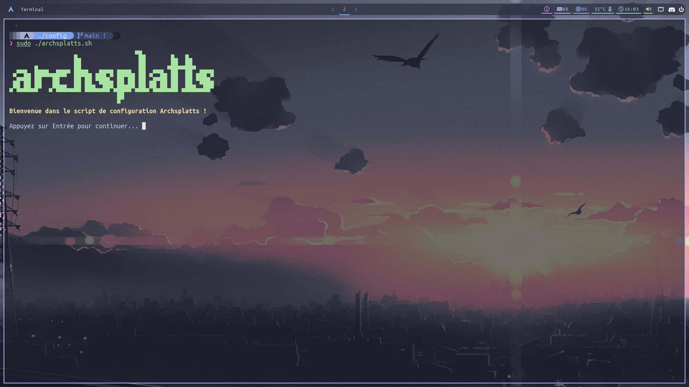

Script post installation ArchLinux avec une configuration Sway

# --- Authentification --- #

Gestionnaire de connexion: sddm

# --- Eléments de l'interface --- #

Barre d'état: waybar   
Lanceur: rofi   
Gestion des fenêtres: sway,autotiling   
Notifications: mako   
Indicateur: swayosd

# --- Terminal & shell --- #

Emulateur de terminal: foot   
Shell: zsh 

# --- Audio & périphériques --- #

Gestion audio: pipewire,wireplumber,pavucontrol   
Gestion de l'alimentation: swayidle,swaylock   

# --- Configuration Clavier & souris --- #

Disposition clavier: fr   
numlock	activé au démarrage (sddm+sway)

# --- Paquets et outils --- #

Navigateur: firefox   
Editeur de texte: geany,micro   
Gestionnaire de fichiers: thunar,yazi   
Surveillance système: btop   
Calendrier: calcurse   
Contrôle GPU: lact   
Jeux: steam   
